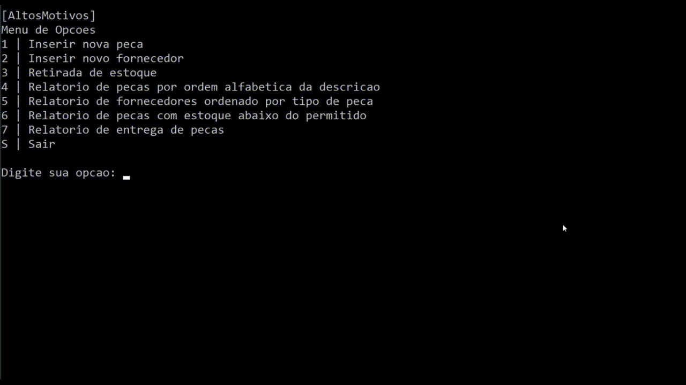

# **AltosMotivos**​ :car:

## Sobre

Programa desenvolvido em C durante uma atividade da faculdade. A *AltosMotivos* é uma empresa fictícia que produz componentes automotivos variados e seu estoque é de até 4000 peças. Sempre que se faz uma retirada de peça é verificado se a quantidade em estoque não está abaixo da quantidade mínima necessária. Quando isso se verificar é necessário repor a quantidade de peças no estoque. A regra da empresa é sempre comprar uma quantidade da peça suficiente para inteirar duas vezes a quantidade mínima definida. O programa tem as seguintes funcionalidades:

- Cadastro de até 4000 peças, cada uma contendo: código numérico único, descrição, tipo, quantidade em estoque e a quantidade mínima.
- Cadastro de até 200 fornecedores, cada um contendo: CNPJ, razão social, endereço, telefone e tipo de peça que ele fornece.
- Retirada de certa quantidade de uma peça do estoque (caso seja possível).
- Exibir relatórios

## Como utilizar

Primeiramente você deve compilar o arquivo *altosmotivos.c* utilizando o compilador de sua preferência. Após aberto, temos um menu com as seguintes opções:

- **1** | Inserir nova peça
- **2** | Inserir novo fornecedor
- **3** | Retirada de estoque
- **4** | Relatório de peças por ordem alfabética da descrição
- **5** | Relatório de fornecedores ordenado por tipo de peça
- **6** | Relatório de peças com estoque abaixo do permitido
- **7** | Relatório de entrega de peças
- **S** | Sair

Para navegar pela aplicação, basta escolher o número da opção desejada ou **S** para sair do programa.